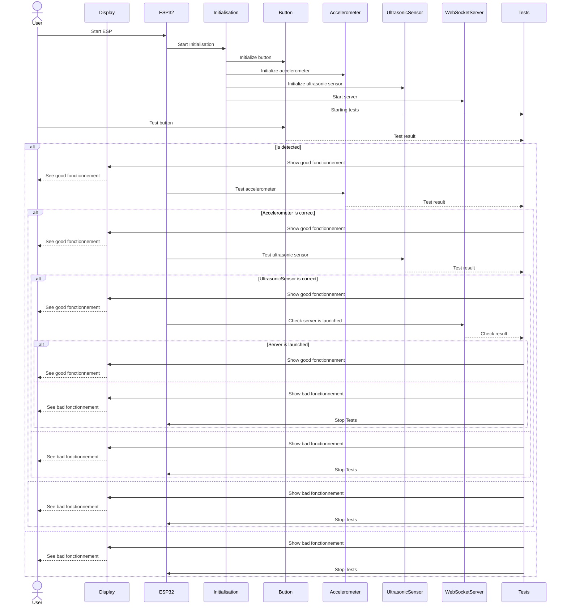

# IOT_Prototype

## Sequence diagram for initialisation of ESP32


## Flow diagram for run of ESP32
```mermaid
graph TD
    A[Start] --> B(Initialize Components)
    B --> C{While True Loop}
    C --> |Button Clicked| D[Detect Button State Change]
    D --> E{State Change?}
    E --> |Yes| F[Send Button State via Socket]
    F --> C
    E --> |No| G{Button Not Clicked for 10 min?}
    G --> |Yes| H[Launch Error Code]
    G --> |No| C
    C --> |Accelerometer Movement| I[Detect Accelerometer Movement]
    I --> J{Movement Detected?}
    J --> |Yes| K[Send Movement via Socket]
    K --> C
    J --> |No| L{No Movement for 3 seconds?}
    L --> |Yes| M[Launch Error Code]
    L --> |No| C
    C --> |Ultrasonic Sensor Distance| N[Detect Ultrasonic Sensor Distance]
    N --> O{Distance Conformity?}
    O --> |Yes| P[Send Conformity Status via Socket]
    P --> C
    O --> |No| Q{No Distance Detected for 3 seconds?}
    Q --> |Yes| R[Launch Error Code]
    Q --> |No| C
    C --> |WebSocket Status| S[Check WebSocket Status]
    S --> T{Server Online?}
    T --> |Yes| U{New Clients?}
    U --> |Yes| V[Handle New Clients]
    V --> C
    U --> |No| W{Clients Disconnected?}
    W --> |Yes| X[Handle Disconnections]
    X --> C
    W --> |No| C
    T --> |No| Y[Launch Error Code]
````

